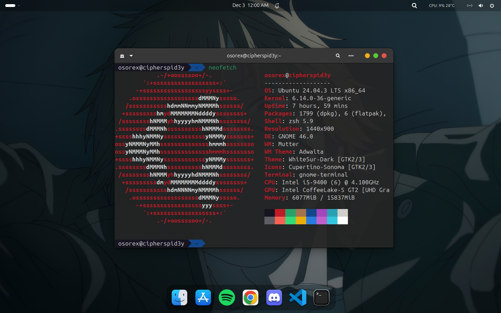

<div align="center">
    <a href="./public/ubuntu-linux.png" target="_blank">
        
    </a>
</div>

# Dotfiles

This repository contains my personal configuration files used for my web development, and cybersecurity environment. I like keeping things minimal but functional, so everything here is tuned for my comfort and productivity.

## Features

- **Unified Terminal Experience**: – Consistent theming and behavior across Kitty, Tmux, and Zsh
- **Productivity-Focused Workflows**: – Custom shortcuts and automation for development tasks
- **Version-Controlled Configuration**: – Easily reproducible environment setup across systems
- **Security-Conscious Defaults**: – Hardened settings for cybersecurity work when applicable

## Extensions

- **App menu is back**: – Restores the classic top-bar application menu.
- **Blur my Shell**: – Adds background blur to panels and overview.
- **Burn My Windows**: – Dramatic window open/close animations.
- **Coverflow Alt-Tab**: – macOS-style 3D window switcher.
- **Dash2Dock Animated**: – Smooth, customizable animated dock.
- **Search Light**: – Enhanced GNOME search with better results.
- **TempTracker**: – Real-time CPU/GPU temperature monitor.
- **User Themes**: – Enables custom shell themes from the user directory.
- **Gnome 4x UI Improvements**: – Polishes and tweaks for the default interface.
- **Compiz windows effect**: – Classic Compiz animations (wobbly windows, cube).
- **Compiz alike magic lamp effect**: – Iconic "magic lamp" minimization effect.

## Environment

- **Operating System**: Ubuntu 24.04.3 LTS x86_64
- **Primary Shell**: Zsh with Oh-My-Zsh framework
- **Terminal**: gnome-terminal
- **Multiplexer**: Tmux for session management
- **Focus Areas**: Web development, security testing, and system administration

## Dotfiles Structure

```
├── public/       # Static assets
├── zsh/          # Zsh shell configuration, aliases, plugins, and custom functions
├── kitty/        # Configuration and theme files for the Kitty terminal emulator
├── tmux/         # Tmux configuration files, scripts, and session setups
```

## Author

**Maintained by:** zyin-jessie  
**Built for:** Developers who value both aesthetics and efficiency in their development environment